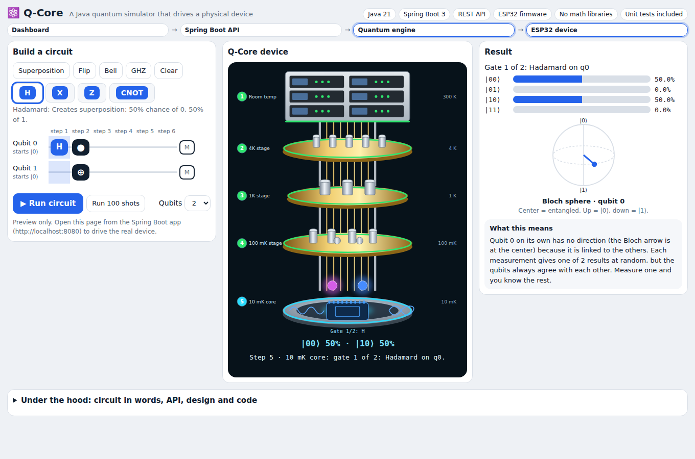

# Q-Core

**A Java quantum-circuit simulator that drives a physical device.** Build a circuit in the dashboard, press Run, and watch a five-layer quantum computer (and, with an ESP32, a real LED display) act out each step.



**Live demo (runs in your browser, no install): https://merhawi7.github.io/q-core/** . It simulates the engine in JavaScript; the Java app runs the real thing.

## What it does
- **Quantum engine (Java 21):** state-vector simulator, 2^n complex amplitudes, up to 5 qubits. Gates H, X, Y, Z, S, T and CNOT, measurement, and the Bloch vector of qubit 0. No math library, just a small `Complex` record.
- **REST API (Spring Boot 3):** `POST /api/circuit/run` returns probabilities, a measured outcome, the Bloch vector and a mode.
- **Device sequence:** a `SequencePlanner` turns a circuit into a timed list of events. A `DeviceClient` plays them on an ESP32 over Wi-Fi. If no device is configured, the API still works.
- **Dashboard:** circuit builder, results, Bloch sphere and an animated device (`src/main/resources/static/index.html`).
- **ESP32 firmware:** LED strip, stepper motor and OLED (`esp32/qcore.ino`).

## Architecture
```
Dashboard --> Spring Boot API --> Quantum engine (Java)
                   |
                   +--> SequencePlanner --> DeviceClient --HTTP--> ESP32 (LEDs, motor, display)
```

## The five layers
The device is modelled on a real dilution-refrigerator quantum computer. The signal passes through five layers, then the gates run on the chip.

| Step | Layer | What it represents |
|---|---|---|
| 1 | Room temperature (300 K) | Control computer, electronics, microwave generators |
| 2 | 4K stage | Attenuators, RF filters, input lines |
| 3 | 1K stage | Thermal and infrared filters |
| 4 | 100 mK stage | Cryogenic amplifiers, circulators, superconducting wiring |
| 5 | 10 mK core | Qubit chip: your gates run here, then the result is measured |

## Quick start
```bash
git clone https://github.com/merhawi7/q-core.git && cd q-core
mvn spring-boot:run          # then open http://localhost:8080
mvn test                     # simulator and planner tests
```
Try it by hand:
```bash
curl -X POST localhost:8080/api/circuit/run -H 'Content-Type: application/json' \
  -d '{"qubits":2,"ops":[{"gate":"H","target":0},{"gate":"CNOT","target":1,"control":0}]}'
```
A Bell state returns `00` and `11` at 0.5 each, and a Bloch vector at the center (the qubit is entangled).

## Run it on a real device
1. Flash `esp32/qcore.ino` (set your Wi-Fi). The OLED shows the ESP32 address when ready.
2. Set `qcore.esp32.url=http://<esp32-address>` in `src/main/resources/application.properties`.
3. Open http://localhost:8080 and press **Run circuit**. The page shows "Device link: LIVE".

LEDs: 30-LED strip, 6 per layer. Finished layers turn green, the active layer pulses, and the result turns the whole strip green.

| Cable | Wires | Connects to |
|---|---|---|
| LED strip | 5V, GND, DATA | DATA to GPIO5 through a 330 ohm resistor |
| Power | 5V, GND | Separate 5V 3A supply, shared GND with the ESP32 |
| Stepper motor | A+, A-, B+, B- | Motor driver (DRV8825 or A4988): STEP to GPIO18, DIR to GPIO19 |
| Display | SDA, SCL, 3.3V, GND | OLED SSD1306: SDA to GPIO21, SCL to GPIO22 |

## Design decisions
- **Pure logic is separate from I/O.** The engine and `SequencePlanner` have no Spring or network code, so they are unit-tested directly.
- **Qubit 0 is the leftmost bit** of a basis label (`|q0 q1>`), matching how the circuit is drawn.
- **Device calls are asynchronous and best-effort.** A new Run cancels the previous sequence, and a missing device never breaks the API.
- **The dashboard and the device share timings,** so the screen and the hardware stay in step.

## Project layout
```
src/main/java/com/quantum/engine   Complex, Qubit, QuantumGate, QuantumCircuit, QuantumSimulator
src/main/java/com/quantum/api      CircuitController, SequencePlanner, DeviceClient, DeviceEvent
src/main/resources/static          dashboard
src/test/java                      simulator and planner tests
esp32/qcore.ino                    firmware
docs/                              GitHub Pages demo and screenshot
```

## Status
The engine, `SequencePlanner` and unit tests pass locally (`mvn test`: 10 tests, 0 failures). The ESP32 firmware has **not** been tested on real hardware yet, so expect to adjust pins, power and libraries. The dashboard's "Preview" mode is a JavaScript port of the same rules.

## Roadmap
Grover and Deutsch-Jozsa examples, a React dashboard, noise models, saving circuits, a real quantum backend.

## License
MIT
